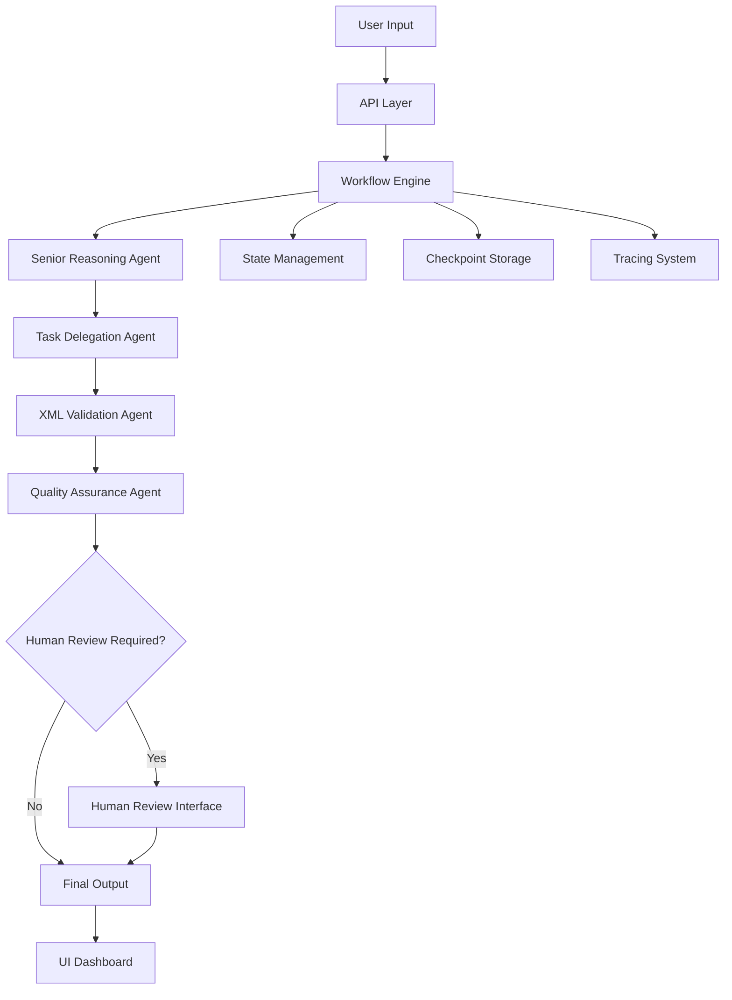
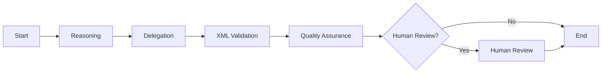
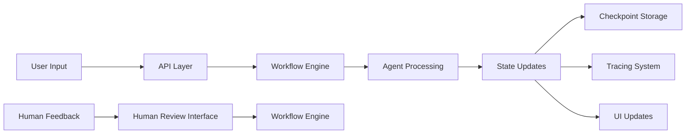

# Multi-Agent Prompt Engine System Design Documentation

## 1. Overview

The Multi-Agent Prompt Engine is a sophisticated AI system that leverages multiple specialized agents working in coordination to process complex prompts through a structured workflow. Built using LangGraph with Directed Acyclic Graph (DAG) subgraphs, the system orchestrates specialized agents to decompose problems, delegate tasks, validate outputs, and ensure quality assurance.

### 1.1 Purpose and Scope

This system is designed to:
- Break down complex problems into manageable reasoning steps
- Delegate tasks to specialized agents based on domain expertise
- Ensure structured communication through XML formatting and validation
- Provide quality assurance and human review checkpoints
- Offer real-time observability through logging and tracing
- Deliver a comprehensive web-based user interface for interaction

### 1.2 Key Features

- **Multi-agent architecture** with role-specific capabilities
- **DAG-based workflow orchestration** using LangGraph
- **Real-time verbose logging** and agent reasoning visualization
- **Human-in-the-loop (HITL)** intervention capabilities
- **Web UI with live updates** and progress tracking
- **Local LLM integration** via Ollama for privacy preservation
- **LangSmith tracing** for comprehensive observability

## 2. System Architecture

### 2.1 High-Level Architecture



### 2.2 Component Architecture

The system consists of several key components:

1. **API Layer** (`src/api`) - FastAPI-based REST interface for external communication
2. **Workflow Engine** (`src/workflow`) - LangGraph-powered orchestration system
3. **Agent System** (`src/agents`) - Specialized agents with distinct capabilities
4. **UI Dashboard** (`src/ui`) - Streamlit-based web interface
5. **Utility Modules** (`src/utils`) - Supporting functionality for monitoring, security, etc.
6. **Configuration** (`src/config`) - System configuration and settings

## 3. Agent System Design

### 3.1 Agent Hierarchy

The system implements a specialized agent hierarchy where each agent has a distinct role. All agents inherit from a common `BaseAgent` class that provides shared functionality:

```python
class BaseAgent:
    def __init__(self, name: str, model: str, base_url: str = "http://localhost:11434"):
        self.name = name
        self.model = model
        self.client = ollama.Client(base_url)
    
    def call_llm(self, prompt: str, system_prompt: str) -> str:
        # Standardized LLM calling interface
        response = self.client.generate(
            model=self.model,
            prompt=prompt,
            system=system_prompt,
            options={
                "temperature": 0.7,
                "top_p": 0.9,
                "stop": ["</output>"]
            }
        )
        return response["response"]
    
    def format_output(self, response: str) -> str:
        # Standardized output formatting
        return response.strip()
```

#### 3.1.1 Senior Reasoning Agent
- **Model**: Qwen3
- **Role**: Breaks down complex problems into step-by-step reasoning processes
- **Output**: Structured XML with reasoning steps, variables, and conclusions

**Internal Processing Flow**:
1. Receives user input from state
2. Constructs specialized prompt with system instructions
3. Calls Qwen3 model via Ollama API
4. Processes and formats response
5. Creates verbose log entry
6. Returns updated state

**System Prompt Structure**:
```xml
<reasoning>
  <step id="[number]" type="[analysis|calculation|inference]">
    <description>[step description]</description>
    <input>[input variables]</input>
    <output>[expected output]</output>
  </step>
</reasoning>

<variables>
  <var name="[name]" type="[string|number|boolean|object]" required="true|false">
    <description>[variable description]</description>
    <format>[format requirements]</format>
    <example>[example value]</example>
  </var>
</variables>

<conclusion>
  <summary>[summary of reasoning]</summary>
  <next_steps>[recommended next steps]</next_steps>
</conclusion>
```

#### 3.1.2 Task Delegation Specialist
- **Model**: Gemma3
- **Role**: Creates detailed XML-formatted task delegation plans
- **Output**: Task definitions with agent assignments, dependencies, and validation rules

**Internal Processing Flow**:
1. Receives problem analysis from state
2. Constructs delegation prompt with system instructions
3. Calls Gemma3 model via Ollama API
4. Processes and formats response
5. Creates verbose log entry
6. Returns updated state

**System Prompt Structure**:
```xml
<delegation>
  <task id="[id]" priority="[high|medium|low]" dependencies="[comma-separated task IDs]">
    <title>[task title]</title>
    <description>[detailed task description]</description>
    <agent role="[agent role]" model="[model]" capability="[specific capability]" />
    <input_requirements>
      <requirement>[required input]</requirement>
    </input_requirements>
    <output_specification>
      <format>XML</format>
      <structure>[expected structure]</structure>
      <validation_rules>
        <rule>[validation rule]</rule>
      </validation_rules>
    </output_specification>
    <time_estimation>[estimated time]</time_estimation>
  </task>
</delegation>
```

#### 3.1.3 XML Formatter & Validator
- **Model**: Gemma3
- **Role**: Ensures all inputs and outputs follow strict XML formatting standards
- **Output**: Validated and properly formatted XML structures

**Internal Processing Flow**:
1. Receives task delegation from state
2. Constructs validation prompt with system instructions
3. Calls Gemma3 model via Ollama API
4. Processes and formats response
5. Validates XML structure using lxml
6. Creates verbose log entry
7. Returns updated state

**System Prompt Structure**:
```xml
<validation>
  <input>[original input]</input>
  <schema_validation>
    <status>valid|invalid</status>
    <issues>
      <issue line="[line number]" severity="error|warning">
        <description>[issue description]</description>
        <suggested_fix>[suggested fix]</suggested_fix>
      </issue>
    </issues>
  </schema_validation>
  <formatting>
    <status>formatted|needs_formatting</status>
    <formatted_output>
      [properly formatted XML output]
    </formatted_output>
  </formatting>
  <compliance>
    <standard>XML 1.0</standard>
    <compliance_level>strict|lenient</compliance_level>
    <issues_resolved>[number]</issues_resolved>
  </compliance>
</validation>
```

#### 3.1.4 Quality Assurance Specialist
- **Model**: Qwen3
- **Role**: Verifies the accuracy, completeness, and quality of all outputs
- **Output**: QA reports with completeness checks, accuracy scores, and approval status

**Internal Processing Flow**:
1. Receives XML validation from state
2. Constructs QA prompt with system instructions
3. Calls Qwen3 model via Ollama API
4. Processes and formats response
5. Creates verbose log entry
6. Returns updated state

**System Prompt Structure**:
```xml
<qa_report>
  <metadata>
    <task_id>[task ID]</task_id>
    <agent_role>[agent role]</agent_role>
    <validation_date>[date]</validation_date>
  </metadata>
  <completeness>
    <status>complete|incomplete</status>
    <missing_elements>
      <element>[missing element]</element>
    </missing_elements>
  </completeness>
  <accuracy>
    <score>[0-100]</score>
    <issues>
      <issue severity="critical|major|minor">
        <description>[issue description]</description>
        <impact>[impact description]</impact>
        <suggested_correction>[suggested correction]</suggested_correction>
      </issue>
    </issues>
  </accuracy>
  <consistency>
    <status>consistent|inconsistent</status>
    <inconsistencies>
      <inconsistency>[description]</inconsistency>
    </inconsistencies>
  </consistency>
  <recommendation>
    <action>approve|revise|reject</action>
    <details>[detailed explanation]</details>
  </recommendation>
  <approval>
    <status>approved|pending|rejected</status>
    <approver>Quality Assurance Specialist</approver>
    <timestamp>[timestamp]</timestamp>
  </approval>
</qa_report>
```

### 3.2 Agent Communication Protocol

Agents communicate through structured XML messages that follow a defined schema:

```xml
<agent_message>
  <metadata>
    <agent_role>[Role Name]</agent_role>
    <timestamp>[ISO Timestamp]</timestamp>
  </metadata>
  <content>
    <!-- Agent-specific structured content -->
  </content>
  <validation>
    <status>valid|invalid</status>
    <errors>
      <!-- Validation errors if any -->
    </errors>
  </validation>
</agent_message>
```

## 4. Workflow Engine

### 4.1 Workflow Architecture

The workflow engine is built using LangGraph and implements a Directed Acyclic Graph (DAG) approach:



### 4.2 LangGraph Implementation Details

The workflow engine uses LangGraph to create a sophisticated state machine with conditional transitions. The implementation in `src/workflow/engine.py` constructs a directed graph where each node represents a processing step:

```python
# Workflow construction in engine.py
workflow = StateGraph(AgentState)

# Add nodes for each processing step
workflow.add_node("reasoning", self._reasoning_node)
workflow.add_node("delegation", self._delegation_node)
workflow.add_node("xml_validation", self._xml_validation_node)
workflow.add_node("qa", self._qa_node)
workflow.add_node("human_review", self._human_review_node)

# Define edges between nodes (representing workflow transitions)
workflow.add_edge("reasoning", "delegation")
workflow.add_edge("delegation", "xml_validation")
workflow.add_edge("xml_validation", "qa")

# Conditional routing based on QA results
workflow.add_conditional_edges(
    "qa",
    self._should_human_review,
    {
        "human_review": "human_review",
        "end": END
    }
)

# Final edge from human review to completion
workflow.add_edge("human_review", END)

# Set entry point
workflow.set_entry_point("reasoning")
```

#### 4.2.1 Node Function Implementation

Each node function follows a consistent pattern with detailed error handling and tracing:

```python
def _reasoning_node(self, state: AgentState) -> Dict[str, Any]:
    """Process the reasoning node with comprehensive tracing and error handling."""
    # Generate unique span ID for this operation
    span_id = str(uuid.uuid4())
    
    # Initiate tracing for this node execution
    tracer.add_span(
        self.trace_id, 
        span_id, 
        "reasoning", 
        {"input": state.get("messages", [])}, 
        {}
    )
    
    try:
        # Delegate to the specialized agent
        result = self.reasoning_agent.process(state)
        
        # Trace the successful result
        tracer.add_span(
            self.trace_id, 
            f"{span_id}_result", 
            "reasoning_result", 
            {}, 
            result
        )
        
        # Return updates to be merged into the shared state
        return result
    except Exception as e:
        # Log error in tracing system
        tracer.log_error(self.trace_id, str(e), "reasoning_error")
        # Re-raise to let LangGraph handle the error
        raise
```

#### 4.2.2 StateGraph Configuration Options

LangGraph provides several configuration options for workflow behavior:

```python
# Compile workflow with various options
self.app = self.workflow.compile(
    checkpointer=self.memory,  # For state persistence
    interrupt_before=["human_review"],  # Pause before human review
    interrupt_after=["qa"]  # Pause after QA for inspection
)

# Configuration for execution
config = {
    "configurable": {
        "thread_id": session_id,  # For checkpointing
        "recursion_limit": 25  # Prevent infinite loops
    },
    "tags": ["workflow_execution"],  # For filtering in tracing
    "metadata": {
        "user_id": user_id,
        "timestamp": time.time()
    }
}
```

#### 4.2.3 Edge Types in LangGraph

LangGraph supports different types of edges for workflow control:

1. **Normal Edges**: Direct transitions between nodes
   ```python
   workflow.add_edge("node_a", "node_b")
   ```

2. **Conditional Edges**: Dynamic routing based on state
   ```python
   workflow.add_conditional_edges(
       "source_node",
       conditional_function,  # Returns next node name
       {
           "condition_1": "target_node_1",
           "condition_2": "target_node_2",
           "default": END
       }
   )
   ```

3. **Mapped Edges**: Parallel execution of multiple nodes
   ```python
   workflow.add_node("map_node", map_function)
   workflow.add_edge("map_node", "reduce_node")
   ```

#### 4.2.4 Workflow Compilation Process

When compiling the workflow, LangGraph performs several validation steps:

1. **Node Validation**: Ensures all referenced nodes exist
2. **Edge Validation**: Checks for unreachable nodes and cycles
3. **Entry Point Validation**: Confirms entry point is defined
4. **Conditional Edge Validation**: Verifies all conditions map to valid nodes

```python
# Compilation process in LangGraph
try:
    compiled_workflow = workflow.compile(checkpointer=self.memory)
except ValidationError as e:
    # Handle compilation errors
    logger.error(f"Workflow compilation failed: {e}")
    raise
```

Each node function follows a consistent pattern:

1. **Tracing Initiation**: Start a trace span for observability
2. **Agent Processing**: Delegate to the appropriate specialized agent
3. **Result Tracing**: Record the results in the trace
4. **State Update**: Return updates to be merged into the shared state

### 4.3 State Management

The system uses a shared state object that flows through each agent:

```python
class AgentState(TypedDict):
    messages: List[Dict[str, str]]
    problem_analysis: str
    task_delegation: str
    xml_validation: str
    final_qa_report: str
    human_review_required: bool
    human_feedback: str
    verbose_logs: List[Dict[str, Any]]
```

#### 4.3.1 State Update Mechanism

LangGraph implements a sophisticated state merging mechanism:

1. **Dictionary Merging**: Returned dictionaries from nodes are deep-merged into the current state
2. **List Concatenation**: List values are extended rather than replaced
3. **Immutable Updates**: New state objects are created rather than modifying existing ones

```python
# Example of how LangGraph merges state updates
# Current state
current_state = {
    "messages": [{"role": "user", "content": "Analyze photosynthesis"}],
    "problem_analysis": "<reasoning>...</reasoning>",
    "verbose_logs": [
        {"timestamp": 1234567890, "agent": "Reasoning", "message": "Completed analysis"}
    ]
}

# Node returns
node_update = {
    "task_delegation": "<delegation>...</delegation>",
    "verbose_logs": [
        {"timestamp": 1234567895, "agent": "Delegation", "message": "Completed delegation"}
    ]
}

# Resulting state after merge
merged_state = {
    "messages": [{"role": "user", "content": "Analyze photosynthesis"}],
    "problem_analysis": "<reasoning>...</reasoning>",
    "task_delegation": "<delegation>...</delegation>",
    "verbose_logs": [
        {"timestamp": 1234567890, "agent": "Reasoning", "message": "Completed analysis"},
        {"timestamp": 1234567895, "agent": "Delegation", "message": "Completed delegation"}
    ]
}
```

#### 4.3.2 State Serialization and Persistence

For checkpointing, the state must be serializable:

```python
# State serialization for checkpointing
import json

# Ensure all state values are JSON serializable
def serialize_state(state: AgentState) -> str:
    # Handle non-serializable objects
    serializable_state = {}
    for key, value in state.items():
        if isinstance(value, (str, int, float, bool, type(None))):
            serializable_state[key] = value
        elif isinstance(value, (list, dict)):
            serializable_state[key] = value
        else:
            # Convert complex objects to serializable format
            serializable_state[key] = str(value)
    
    return json.dumps(serializable_state, indent=2)

# State deserialization
def deserialize_state(serialized_state: str) -> AgentState:
    return json.loads(serialized_state)
```

#### 4.3.3 State Validation

State validation ensures consistency throughout the workflow:

```python
from pydantic import validate_arguments

# Validate state at critical points
@validate_arguments
def validate_state_consistency(state: AgentState) -> bool:
    # Check required fields
    required_fields = [
        "messages", "problem_analysis", "task_delegation", 
        "xml_validation", "final_qa_report"
    ]
    
    for field in required_fields:
        if field not in state:
            raise ValueError(f"Missing required field: {field}")
    
    # Validate XML structure
    if state["problem_analysis"] and not is_valid_xml(state["problem_analysis"]):
        raise ValueError("Invalid XML in problem_analysis")
    
    return True
```

Each agent receives the current state and returns updates to be merged into the state:

```python
# Example agent processing pattern
def _reasoning_node(self, state: AgentState) -> Dict[str, Any]:
    # Process using the SeniorReasoningAgent
    result = self.reasoning_agent.process(state)
    
    # Return updates to be merged into state
    return {
        "problem_analysis": result["problem_analysis"],
        "verbose_logs": state.get("verbose_logs", []) + [result["verbose_log"]]
    }
```

LangGraph automatically merges these returned dictionaries into the state, ensuring that:
- Previous state values are preserved
- New values overwrite existing ones
- Lists are extended rather than replaced

### 4.4 Conditional Routing

The workflow implements conditional routing based on QA results:

- If QA report indicates issues or critical tasks, human review is triggered
- If QA report is satisfactory, workflow proceeds to completion

```python
def _should_human_review(self, state: AgentState) -> str:
    """Determine if human review is required based on QA report."""
    # Check if human review is needed based on QA report
    return "human_review" if self.human_review_interface.should_request_review(state) else "end"
```

This decision-making process examines the QA report for:
- Low accuracy scores
- Critical or major issues
- Incomplete tasks
- Specific flags set by the QA agent

### 4.5 Checkpointing and Persistence

LangGraph provides built-in checkpointing capabilities for workflow persistence:

```python
# Memory-based checkpointing
from langgraph.checkpoint.memory import MemorySaver

# Initialize memory
self.memory = MemorySaver()

# Compile workflow with checkpointer
self.app = self.workflow.compile(checkpointer=self.memory)

# Run with checkpointing
config = {"configurable": {"thread_id": session_id}}
result = self.app.invoke(initial_state, config)
```

#### 4.5.1 Checkpoint Data Structure

Each checkpoint contains comprehensive information about the workflow state:

```python
# Checkpoint structure
checkpoint = {
    "v": 1,  # Version
    "ts": "2023-01-01T00:00:00Z",  # Timestamp
    "id": "checkpoint_id",  # Unique identifier
    "channel_values": {  # Current state values
        "messages": [...],
        "problem_analysis": "...",
        "task_delegation": "...",
        # ... other state fields
    },
    "channel_versions": {  # Version tracking for each channel
        "__root__": 3,
        "messages": 1,
        "problem_analysis": 1
    },
    "versions_seen": {  # Versions seen by each node
        "reasoning": {
            "__root__": 1,
            "messages": 1
        },
        "delegation": {
            "__root__": 2,
            "problem_analysis": 1
        }
    },
    "pending_sends": []  # Pending messages
}
```

#### 4.5.2 Custom Checkpoint Storage

The system implements file-based checkpoint storage in `src/workflow/engine.py`:

```python
class FileCheckpointStorage:
    def __init__(self, base_path: str = "./checkpoints"):
        self.base_path = base_path
        os.makedirs(base_path, exist_ok=True)
    
    def save_checkpoint(self, session_id: str, checkpoint_data: Dict[str, Any]):
        """Save checkpoint to file."""
        filename = f"{self.base_path}/{session_id}.json"
        with open(filename, "w") as f:
            json.dump(checkpoint_data, f, indent=2, default=str)
    
    def load_checkpoint(self, session_id: str) -> Optional[Dict[str, Any]]:
        """Load checkpoint from file."""
        filename = f"{self.base_path}/{session_id}.json"
        if os.path.exists(filename):
            with open(filename, "r") as f:
                return json.load(f)
        return None
```

#### 4.5.3 Checkpoint Lifecycle Management

Checkpoints are created at critical workflow points:

```python
def run(self, input_message: str) -> Dict[str, Any]:
    """Run the workflow with checkpointing at key points."""
    # Create initial checkpoint
    initial_state = self._create_initial_state(input_message)
    session_id = str(uuid.uuid4())
    
    checkpoint_storage.save_checkpoint(session_id, {
        "state": initial_state,
        "timestamp": time.time(),
        "status": "started"
    })
    
    # Execute workflow
    config = {"configurable": {"thread_id": session_id}}
    result = self.app.invoke(initial_state, config)
    
    # Create final checkpoint
    checkpoint_storage.save_checkpoint(session_id, {
        "state": result,
        "timestamp": time.time(),
        "status": "completed"
    })
    
    return result
```

This enables:
- Workflow state persistence across sessions
- Resumption of interrupted workflows
- Audit trail of state changes
- Debugging and replay capabilities

Checkpoint data includes:
- Complete state at each step
- Timestamps for all transitions
- Configuration parameters
- Execution metadata

### 4.6 LangGraph Execution Model

The LangGraph execution model follows these principles:

1. **Asynchronous Processing**: Nodes can be executed asynchronously when there are no dependencies
2. **Deterministic Transitions**: All transitions are explicitly defined
3. **State Immutability**: States are treated as immutable; updates create new state versions
4. **Backpressure Handling**: The system can pause execution when resources are constrained

The execution flow:
1. Start with initial state
2. Execute entry point node
3. Follow edges to next nodes
4. Apply conditional logic for branching
5. Continue until reaching END node
6. Return final state

#### 4.6.1 Execution Context and Threading

LangGraph manages execution context through thread-local storage:

```python
# Thread-local context management
import threading

class ExecutionContext:
    def __init__(self):
        self._local = threading.local()
    
    def set_context(self, context_data: Dict[str, Any]):
        self._local.context = context_data
    
    def get_context(self) -> Dict[str, Any]:
        return getattr(self._local, "context", {})

# Usage in workflow engine
execution_context = ExecutionContext()

def _reasoning_node(self, state: AgentState) -> Dict[str, Any]:
    # Set execution context for this node
    execution_context.set_context({
        "node": "reasoning",
        "trace_id": self.trace_id,
        "session_id": self.current_session_id
    })
    
    # Process with context available
    result = self.reasoning_agent.process(state)
    
    return result
```

#### 4.6.2 Recursion and Loop Prevention

LangGraph implements recursion limits to prevent infinite loops:

```python
# Recursion limit configuration
config = {
    "configurable": {
        "recursion_limit": 25  # Default limit
    }
}

# Monitoring recursion depth
class RecursionMonitor:
    def __init__(self, limit: int = 25):
        self.limit = limit
        self.depth = 0
    
    def increment(self):
        self.depth += 1
        if self.depth > self.limit:
            raise RecursionError(f"Recursion limit exceeded: {self.limit}")
    
    def decrement(self):
        self.depth = max(0, self.depth - 1)
```

#### 4.6.3 Parallel Execution Capabilities

LangGraph supports parallel execution through map-reduce patterns:

```python
# Parallel task execution
from langgraph.graph import StateGraph

# Define a map node that processes multiple items
async def map_node(state: AgentState) -> Dict[str, Any]:
    tasks = state.get("tasks", [])
    results = []
    
    # Process tasks in parallel
    async with asyncio.TaskGroup() as tg:
        for task in tasks:
            task_result = tg.create_task(process_single_task(task))
            results.append(task_result)
    
    # Collect results
    completed_results = [result.result() for result in results]
    
    return {"task_results": completed_results}

# Add to workflow
workflow.add_node("parallel_processing", map_node)
```

#### 4.6.4 Interrupt and Resume Mechanisms

LangGraph supports workflow interruption and resumption:

```python
# Configure workflow with interrupts
app = workflow.compile(
    checkpointer=memory_saver,
    interrupt_before=["human_review"],  # Pause before human review
    interrupt_after=["qa"]  # Pause after QA
)

# Check for interrupts
if app.get_state(config).next:
    # Workflow is interrupted
    interrupted_nodes = app.get_state(config).next
    print(f"Interrupted at nodes: {interrupted_nodes}")

# Resume interrupted workflow
result = app.invoke(None, config)  # None means continue from interrupt
```

## 5. API Layer

The API layer is built using FastAPI and provides a RESTful interface for interacting with the multi-agent system. It handles authentication, workflow orchestration, real-time updates, and system monitoring.

### 5.1 REST API Endpoints

The system exposes the following API endpoints:

| Endpoint | Method | Description |
|----------|--------|-------------|
| `/` | GET | Root endpoint |
| `/health` | GET | Health check |
| `/auth` | POST | Authentication |
| `/process-prompt` | POST | Process a prompt through the workflow |
| `/session/{session_id}` | GET | Get session status |
| `/submit-feedback` | POST | Submit human feedback |
| `/models` | GET | List available models |
| `/stream-workflow/{session_id}` | GET | Stream workflow updates |
| `/performance/metrics` | GET | Get performance metrics |
| `/export/session` | POST | Export session data |
| `/export/logs` | POST | Export log data |

#### 5.1.1 Endpoint Details

**`POST /process-prompt`**
- **Purpose**: Initiates a new workflow processing session
- **Authentication**: Optional (if provided, validates session)
- **Request Body**: `PromptRequest` model
- **Response**: `SessionStatus` with new session ID
- **Processing**: Asynchronously starts workflow in background

```python
@app.post("/process-prompt", response_model=SessionStatus)
async def process_prompt(
    request: PromptRequest, 
    background_tasks: BackgroundTasks,
    authorization: Optional[str] = Header(None)
):
    """Process a prompt through the multi-agent workflow."""
    # Authentication check
    user_id = self._authenticate_user(authorization)
    
    # Generate session ID
    session_id = request.session_id or str(uuid.uuid4())
    
    # Initialize session state
    active_sessions[session_id] = {
        "status": "processing",
        "result": None,
        "logs": [],
        "last_updated": time.time()
    }
    
    # Log the event
    security_manager.log_audit_event(
        "prompt_processing", 
        user_id, 
        {"session_id": session_id, "prompt_length": len(request.prompt)}
    )
    
    # Start workflow in background
    background_tasks.add_task(run_workflow, session_id, request.prompt, user_id)
    
    return SessionStatus(session_id=session_id, status="processing")
```

**`GET /stream-workflow/{session_id}`**
- **Purpose**: Provides real-time updates for an active workflow
- **Authentication**: Required for access control
- **Protocol**: Server-Sent Events (SSE)
- **Response**: Continuous stream of log updates and status changes

```python
@app.get("/stream-workflow/{session_id}")
async def stream_workflow(
    session_id: str,
    authorization: Optional[str] = Header(None)
):
    """Stream workflow updates using Server-Sent Events."""
    # Authentication and authorization
    self._authorize_user(authorization, "view_logs")
    
    # Validate session exists
    if session_id not in active_sessions:
        raise HTTPException(status_code=404, detail="Session not found")
    
    async def event_generator():
        last_log_index = 0
        
        while True:
            if session_id not in active_sessions:
                break
                
            session = active_sessions[session_id]
            logs = session.get("logs", [])
            
            # Send new logs
            if len(logs) > last_log_index:
                for i in range(last_log_index, len(logs)):
                    log_entry = logs[i]
                    data = {
                        "status": session["status"],
                        "log": log_entry
                    }
                    yield f"data: {json.dumps(data)}\n\n"
                last_log_index = len(logs)
            
            # Check for completion
            if session["status"] in ["completed", "error", "feedback_received"]:
                final_data = {
                    "status": session["status"],
                    "result": session.get("result"),
                    "final": True
                }
                yield f"data: {json.dumps(final_data)}\n\n"
                break
            
            await asyncio.sleep(1)
    
    return StreamingResponse(event_generator(), media_type="text/event-stream")
```

**`GET /health`**
- **Purpose**: System health and status monitoring
- **Authentication**: None (public endpoint)
- **Response**: System status, Ollama server status, and model availability

```python
@app.get("/health")
async def health_check():
    """Health check endpoint."""
    # Check Ollama server status
    server_status = ollama_monitor.check_server_status()
    
    # Collect system metrics
    system_metrics = performance_monitor.collect_system_metrics()
    ollama_metrics = performance_monitor.collect_ollama_metrics()
    
    # Check model availability
    models = ollama_monitor.client.list_models()
    
    return {
        "status": "healthy" if server_status else "unhealthy",
        "ollama_server": "running" if server_status else "not running",
        "models": models,
        "system_metrics": system_metrics,
        "ollama_metrics": ollama_metrics
    }
```

### 5.2 Data Models

#### 5.2.1 PromptRequest
```json
{
  "prompt": "string",
  "session_id": "string (optional)"
}
```

Pydantic model implementation:
```python
class PromptRequest(BaseModel):
    prompt: str
    session_id: Optional[str] = None
```

#### 5.2.2 SessionStatus
```json
{
  "session_id": "string",
  "status": "string",
  "result": "object (optional)",
  "logs": "array"
}
```

Pydantic model implementation:
```python
class SessionStatus(BaseModel):
    session_id: str
    status: str
    result: Optional[Dict[str, Any]] = None
    logs: List[Dict[str, Any]] = []
```

#### 5.2.3 FeedbackRequest
```json
{
  "session_id": "string",
  "feedback": "string"
}
```

#### 5.2.4 AuthRequest
```json
{
  "user_id": "string",
  "password": "string"
}
```

#### 5.2.5 ExportRequest
```json
{
  "session_id": "string",
  "format": "string"
}
```

### 5.3 Authentication and Security

The API implements session-based authentication:

#### 5.3.1 Authentication Flow

1. **Login Request**
   - Client sends `AuthRequest` to `/auth`
   - Server validates credentials (simplified in current implementation)
   - Server creates session with permissions

2. **Session Management**
   - Session tokens generated with expiration
   - Permissions stored with session
   - Session validation on protected endpoints

3. **Access Control**
   - Role-based permissions
   - Endpoint-specific access checks
   - Audit logging of access attempts

#### 5.3.2 Security Features

- **Input Validation**: Pydantic models for request validation
- **Session Security**: Secure token generation and validation
- **CORS Protection**: Configured CORS middleware
- **Rate Limiting**: (Planned) To prevent abuse
- **Audit Logging**: All authentication and critical operations logged

### 5.4 Asynchronous Processing

The API leverages FastAPI's async capabilities:

#### 5.4.1 Background Tasks

Workflow processing runs in background tasks to avoid blocking:
```python
@app.post("/process-prompt", response_model=SessionStatus)
async def process_prompt(
    request: PromptRequest, 
    background_tasks: BackgroundTasks,
    authorization: Optional[str] = Header(None)
):
    # Store session immediately
    # Add workflow to background tasks
    background_tasks.add_task(run_workflow, session_id, request.prompt, user_id)
    
    return SessionStatus(session_id=session_id, status="processing")
```

#### 5.4.2 Real-time Updates

Server-Sent Events provide real-time updates to clients:
- Continuous connection for log streaming
- Automatic reconnection handling
- Efficient data transfer with minimal overhead

### 5.5 Error Handling

The API implements comprehensive error handling:

#### 5.5.1 HTTP Exception Handling

- **400 Bad Request**: Invalid input data
- **401 Unauthorized**: Invalid or missing authentication
- **403 Forbidden**: Insufficient permissions
- **404 Not Found**: Resource not found
- **500 Internal Server Error**: Unexpected server errors

#### 5.5.2 Error Response Format

```json
{
  "detail": "Error message describing the problem"
}
```

### 5.6 API Documentation

FastAPI automatically generates interactive API documentation:

- **Swagger UI**: Available at `/docs`
- **ReDoc**: Available at `/redoc`
- **OpenAPI Schema**: Available at `/openapi.json`

The documentation includes:
- Endpoint descriptions
- Request/response schemas
- Example requests
- Interactive testing interface

## 6. UI Dashboard

### 6.1 Dashboard Components

The Streamlit-based dashboard provides:

1. **Prompt Input Interface** - Text area for entering prompts
2. **Session Management** - Tracking of active sessions
3. **Real-time Logging** - Live display of agent activities
4. **Result Visualization** - Presentation of final outputs
5. **Export Functionality** - Data export in multiple formats

### 6.2 User Workflow

1. User enters a prompt in the text area
2. User clicks "Process Prompt" to start workflow
3. Dashboard connects to SSE endpoint for real-time updates
4. Logs and progress are displayed as workflow executes
5. Final results are presented upon completion
6. User can export session data or logs

## 7. Data Flow and Storage

### 7.1 Data Flow Diagram



### 7.2 Detailed Data Flow

The data flow in the system follows a structured path through multiple layers:

#### 7.2.1 Input Processing Flow

1. **User Input Reception**
   - Prompt received via REST API endpoint `/process-prompt`
   - Input validation and sanitization
   - Session initialization
   - Authentication and authorization checks

2. **State Initialization**
   ```python
   initial_state = {
       "messages": [{"role": "user", "content": input_message}],
       "problem_analysis": "",
       "task_delegation": "",
       "xml_validation": "",
       "final_qa_report": "",
       "human_review_required": False,
       "human_feedback": "",
       "verbose_logs": []
   }
   ```

3. **Workflow Initiation**
   - Checkpoint created for session
   - Tracing context initialized
   - Asynchronous workflow execution begins

#### 7.2.2 State Propagation Mechanism

The state flows through the workflow via LangGraph's channel system:

```python
# State propagation through LangGraph channels
# Each node receives the current state and returns updates

# Example of state flow through nodes:
# 1. Initial State -> Reasoning Node
#    - Node receives: {"messages": [...], "problem_analysis": "", ...}
#    - Node processes and returns: {"problem_analysis": "<xml>...</xml>"}
#    - State updated to: {"messages": [...], "problem_analysis": "<xml>...</xml>", ...}

# 2. Updated State -> Delegation Node
#    - Node receives: {"messages": [...], "problem_analysis": "<xml>...</xml>", ...}
#    - Node processes and returns: {"task_delegation": "<xml>...</xml>"}
#    - State updated to: {"messages": [...], "problem_analysis": "<xml>...</xml>", "task_delegation": "<xml>...</xml>", ...}
```

#### 7.2.3 Data Transformation Pipeline

Each agent implements a standardized data transformation pipeline:

```python
# Standard agent processing pipeline
class BaseAgent:
    def process(self, state: AgentState) -> Dict[str, Any]:
        # 1. Extract relevant data from state
        input_data = self._extract_input(state)
        
        # 2. Format prompt for LLM
        prompt, system_prompt = self._format_prompt(input_data)
        
        # 3. Call LLM
        llm_response = self.call_llm(prompt, system_prompt)
        
        # 4. Validate and format output
        formatted_output = self._validate_and_format(llm_response)
        
        # 5. Create verbose log
        verbose_log = self._create_verbose_log(formatted_output)
        
        # 6. Return state updates
        return self._prepare_state_updates(formatted_output, verbose_log)
```

#### 7.2.4 Error Propagation and Handling

Errors flow through the system with proper context preservation:

```python
# Error handling in agent processing
try:
    llm_response = self.call_llm(prompt, system_prompt)
except LLMConnectionError as e:
    # Log error with context
    error_context = {
        "agent": self.name,
        "model": self.model,
        "input_length": len(prompt),
        "error": str(e)
    }
    logger.error("LLM connection failed", extra=error_context)
    
    # Return partial state update with error information
    return {
        "error": f"LLM connection failed: {str(e)}",
        "verbose_logs": [create_error_log(self.name, str(e))]
    }
```

#### 7.2.5 Asynchronous Data Flow

The system handles asynchronous data flow for real-time updates:

```python
# Asynchronous streaming of workflow updates
async def stream_workflow_updates(session_id: str):
    """Stream workflow updates to connected clients."""
    last_checkpoint_version = 0
    
    while True:
        # Check for new checkpoints
        current_checkpoint = checkpoint_storage.get_latest_checkpoint(session_id)
        
        if current_checkpoint and current_checkpoint.version > last_checkpoint_version:
            # Send update to connected clients
            await self._send_update_to_clients(current_checkpoint)
            last_checkpoint_version = current_checkpoint.version
        
        # Check if workflow is complete
        if self._is_workflow_complete(session_id):
            break
        
        # Wait before checking again
        await asyncio.sleep(0.5)
```

#### 7.2.2 Agent Processing Flow

Each agent follows a consistent data processing pattern:

1. **Input Reception**
   - Agent receives current state
   - Extracts relevant information for processing

2. **LLM Interaction**
   - Constructs specialized prompts for the LLM
   - Calls Ollama API with model-specific parameters
   - Receives and processes LLM response

3. **Output Formatting**
   - Structures output according to XML schema
   - Validates output against defined standards
   - Creates verbose logging entries

4. **State Update**
   - Returns structured updates to workflow engine
   - Updates are merged into shared state

#### 7.2.3 Conditional Routing Flow

The QA agent determines workflow continuation:

1. **QA Report Analysis**
   - Parses QA report for decision criteria
   - Evaluates accuracy scores and issue severity
   - Checks for completeness flags

2. **Routing Decision**
   - Decision function returns next node identifier
   - Human review triggered if criteria met
   - Direct completion if satisfactory

#### 7.2.4 Output and Feedback Flow

1. **Result Compilation**
   - Final state collected after workflow completion
   - Results formatted for UI presentation
   - Export data prepared

2. **UI Streaming**
   - Real-time updates via Server-Sent Events
   - Log entries pushed to connected clients
   - Status updates for workflow progress

3. **Human Feedback Integration**
   - Feedback received via `/submit-feedback` endpoint
   - Feedback incorporated into workflow state
   - Workflow continuation triggered

### 7.3 Storage Components

#### 7.3.1 Checkpoint Storage

- **Purpose**: Persists workflow state for recovery and debugging
- **Implementation**: File-based JSON storage in `checkpoints/` directory
- **Structure**:
  ```json
  {
    "state": { /* complete workflow state */ },
    "timestamp": 1234567890.123,
    "status": "started|processing|completed|error"
  }
  ```
- **Features**:
  - Automatic checkpointing at workflow start and completion
  - Unique session-based file naming
  - Timestamp-based versioning

#### 7.3.2 Audit Logs

- **Purpose**: Records system events for compliance and debugging
- **Implementation**: JSON log files in `audit_logs/` directory
- **Structure**:
  ```json
  {
    "timestamp": "2023-01-01T00:00:00Z",
    "event_type": "prompt_processing|authentication|feedback_submission",
    "user_id": "user123",
    "details": { /* event-specific details */ }
  }
  ```
- **Features**:
  - Daily log rotation
  - Structured event logging
  - Security-relevant event capture

#### 7.3.3 Performance Logs

- **Purpose**: Tracks system metrics for optimization
- **Implementation**: JSON metrics files in `performance_logs/` directory
- **Structure**:
  ```json
  {
    "timestamp": "2023-01-01T00:00:00Z",
    "metrics": {
      "response_times": { /* agent response times */ },
      "memory_usage": 123456,
      "cpu_usage": 45.6,
      "llm_calls": 4
    }
  }
  ```
- **Features**:
  - Performance metric collection
  - Resource utilization tracking
  - Bottleneck identification

### 7.4 Data Serialization and Communication

#### 7.4.1 State Serialization

The system uses Python dictionaries for state representation:
- Automatic serialization via LangGraph
- JSON-compatible structures for persistence
- Type hints for maintainability

#### 7.4.2 XML Communication Protocol

Agents communicate using structured XML:
- Schema validation for data integrity
- Nested element support for complex data
- Attribute-based metadata inclusion

#### 7.4.3 API Data Transfer

REST API uses JSON for data exchange:
- Pydantic models for request/response validation
- Automatic serialization/deserialization
- Error handling for malformed requests

### 7.5 Data Security and Privacy

#### 7.5.1 Data Protection Measures

- Input sanitization through XML schema validation
- No storage of sensitive user data
- Secure session management
- Encryption of data in transit

#### 7.5.2 Privacy Considerations

- All processing occurs locally
- No external data transmission
- User prompts not stored permanently
- Session-based data isolation

## 8. Security and Compliance

### 8.1 Authentication and Authorization

- Session-based authentication
- Role-based access control (RBAC)
- Audit logging for all critical operations

### 8.2 Data Protection

- Input sanitization through XML schema validation
- Secure session management
- Encryption of sensitive data in transit and at rest

## 9. Observability and Monitoring

### 9.1 Tracing System

The system implements comprehensive tracing using a custom tracing system in `src/workflow/tracing.py`:

```python
class Tracer:
    def __init__(self):
        self.traces = {}
    
    def start_trace(self, trace_id: str, name: str, metadata: Dict[str, Any]):
        self.traces[trace_id] = {
            "name": name,
            "start_time": time.time(),
            "metadata": metadata,
            "spans": {}
        }
    
    def add_span(self, trace_id: str, span_id: str, name: str, 
                 input_data: Dict[str, Any], output_data: Dict[str, Any]):
        if trace_id in self.traces:
            self.traces[trace_id]["spans"][span_id] = {
                "name": name,
                "start_time": time.time(),
                "input": input_data,
                "output": output_data
            }
    
    def end_trace(self, trace_id: str, result: Dict[str, Any]):
        if trace_id in self.traces:
            self.traces[trace_id]["end_time"] = time.time()
            self.traces[trace_id]["result"] = result
```

#### 9.1.1 Advanced Tracing Features

The tracing system implements several advanced features for comprehensive observability:

**Hierarchical Tracing**: Nested spans for complex operations
```python
# Nested span example
def process_complex_task(self, state: AgentState) -> Dict[str, Any]:
    # Main span
    main_span_id = str(uuid.uuid4())
    tracer.add_span(
        self.trace_id, 
        main_span_id, 
        "complex_task", 
        {"input": state}, 
        {}
    )
    
    # Sub-spans for different phases
    analysis_span_id = str(uuid.uuid4())
    tracer.add_span(
        self.trace_id, 
        analysis_span_id, 
        "task_analysis", 
        {"task_data": state.get("task_data")}, 
        {}
    )
    
    # Perform analysis
    analysis_result = self._analyze_task(state)
    tracer.update_span_output(self.trace_id, analysis_span_id, analysis_result)
    
    # Processing span
    processing_span_id = str(uuid.uuid4())
    tracer.add_span(
        self.trace_id, 
        processing_span_id, 
        "task_processing", 
        analysis_result, 
        {}
    )
    
    # Perform processing
    final_result = self._process_task(analysis_result)
    tracer.update_span_output(self.trace_id, processing_span_id, final_result)
    
    # Update main span
    tracer.update_span_output(self.trace_id, main_span_id, final_result)
    
    return final_result
```

**Performance Monitoring**: Execution time tracking for each component
```python
# Performance metrics collection
class PerformanceMetrics:
    def __init__(self):
        self.metrics = {}
    
    def record_timing(self, operation: str, duration: float):
        if operation not in self.metrics:
            self.metrics[operation] = []
        self.metrics[operation].append(duration)
    
    def get_average_time(self, operation: str) -> float:
        if operation in self.metrics and self.metrics[operation]:
            return sum(self.metrics[operation]) / len(self.metrics[operation])
        return 0.0

# Usage in tracing
tracer.performance_monitor = PerformanceMetrics()

# In span completion
def end_span(self, trace_id: str, span_id: str, output_data: Dict[str, Any]):
    if trace_id in self.traces and span_id in self.traces[trace_id]["spans"]:
        span = self.traces[trace_id]["spans"][span_id]
        duration = time.time() - span["start_time"]
        span["end_time"] = time.time()
        span["duration"] = duration
        span["output"] = output_data
        
        # Record performance metric
        self.performance_monitor.record_timing(span["name"], duration)
```

**Tracing Context Propagation**:
```python
# Context propagation across async boundaries
import contextvars

trace_context = contextvars.ContextVar("trace_context", default=None)

# Set context
trace_context.set({
    "trace_id": trace_id,
    "span_id": span_id
})

# Get context in async functions
def get_current_trace_context():
    return trace_context.get()
```

**Tracing Data Export**:
```python
# Export traces for analysis
class TraceExporter:
    def export_to_json(self, trace_data: Dict[str, Any], filename: str):
        with open(filename, "w") as f:
            json.dump(trace_data, f, indent=2, default=str)
    
    def export_to_database(self, trace_data: Dict[str, Any]):
        # Export to monitoring database
        pass
    
    def export_to_external_system(self, trace_data: Dict[str, Any], system: str):
        # Export to external tracing systems like Jaeger or Zipkin
        pass
```

**Tracing Features**:
- **Hierarchical Tracing**: Nested spans for complex operations
- **Performance Monitoring**: Execution time tracking for each component
- **Error Tracking**: Automatic error capture and reporting
- **Data Flow Visualization**: Input/output tracking for each processing step
- **Metadata Collection**: Contextual information for debugging

**Trace Structure**:
```json
{
  "workflow_trace": {
    "name": "workflow_engine",
    "start_time": 1234567890.123,
    "end_time": 1234567895.456,
    "metadata": {
      "qwen_model": "qwen3:latest",
      "gemma_model": "gemma3:latest"
    },
    "spans": {
      "reasoning_span": {
        "name": "reasoning",
        "start_time": 1234567890.123,
        "input": {"messages": [{"role": "user", "content": "Analyze..."}]},
        "output": {"problem_analysis": "<reasoning>...</reasoning>"},
        "duration": 2.34
      },
      "delegation_span": {
        "name": "delegation",
        "start_time": 1234567892.467,
        "input": {"problem_analysis": "<reasoning>...</reasoning>"},
        "output": {"task_delegation": "<delegation>...</delegation>"},
        "duration": 1.89
      }
    }
  }
}
```

### 9.2 Logging

The system implements structured verbose logging for comprehensive observability:

#### 9.2.1 Log Structure

Each log entry follows a standardized structure:
```python
def create_verbose_log(agent_name: str, message: str, details: Dict[str, Any] = None) -> Dict[str, Any]:
    return {
        "timestamp": time.time(),
        "agent": agent_name,
        "message": message,
        "details": details or {},
        "level": "INFO"
    }
```

#### 9.2.2 Logging Components

1. **Agent-Level Logging**
   - Per-agent verbose logging
   - Processing time tracking
   - Input/output size monitoring

2. **Workflow-Level Logging**
   - State transition tracking
   - Checkpoint events
   - Error and exception logging

3. **System-Level Logging**
   - API request/response logging
   - Performance metrics
   - Resource utilization

#### 9.2.3 Log Streaming

Real-time log streaming to the UI is implemented using Server-Sent Events:

```python
async def event_generator() -> AsyncGenerator[str, None]:
    last_log_index = 0
    
    while True:
        # Check for new logs
        logs = session.get("logs", [])
        if len(logs) > last_log_index:
            # Send new logs to connected clients
            for i in range(last_log_index, len(logs)):
                log_entry = logs[i]
                data = {
                    "status": session["status"],
                    "log": log_entry
                }
                yield f"data: {json.dumps(data)}\n\n"
            last_log_index = len(logs)
        
        # Check if workflow is completed
        if session["status"] in ["completed", "error", "feedback_received"]:
            final_data = {
                "status": session["status"],
                "result": session.get("result"),
                "final": True
            }
            yield f"data: {json.dumps(final_data)}\n\n"
            break
        
        # Wait before checking again
        await asyncio.sleep(1)
```

#### 9.2.4 Log Storage

Logs are persisted for audit and debugging purposes:
- **Format**: JSON for structured data
- **Rotation**: Daily rotation to manage file sizes
- **Retention**: Configurable retention policies
- **Searchability**: Structured format enables easy querying

### 9.3 Performance Monitoring

The system includes comprehensive performance monitoring:

#### 9.3.1 Metrics Collection

- **Response Time Metrics**: Per-agent and overall workflow timing
- **Resource Utilization**: CPU, memory, and GPU usage
- **LLM Call Statistics**: Number of calls, average response times
- **Error Rates**: Exception frequency and types

#### 9.3.2 Monitoring Endpoints

The API provides performance metrics via `/performance/metrics`:
```json
{
  "timestamp": "2023-01-01T00:00:00Z",
  "system": {
    "cpu_percent": 45.2,
    "memory_percent": 67.8,
    "disk_usage": 23.4
  },
  "ollama": {
    "server_status": "running",
    "active_models": ["qwen3:latest", "gemma3:latest"],
    "gpu_available": true
  },
  "workflow": {
    "average_response_time": 4.56,
    "success_rate": 98.7,
    "active_sessions": 3
  }
}
```

#### 9.3.3 Alerting System

- **Threshold-Based Alerts**: Notifications for performance degradation
- **Error Rate Monitoring**: Alerts for unusual error patterns
- **Resource Exhaustion Warnings**: Notifications for high resource usage

## 10. Deployment Architecture

### 10.1 System Requirements

- Python 3.10+
- Ollama with Qwen3 and Gemma3 models
- Node.js for UI components (optional)

### 10.2 Deployment Options

1. **Local Development**
   ```bash
   uvicorn src.api.main:app --reload
   streamlit run src/ui/dashboard.py
   ```

2. **Production Deployment**
   ```bash
   python start_system.py
   ```

### 10.3 Scaling Considerations

- Horizontal scaling of API layer
- Model-specific resource allocation
- Asynchronous processing for improved throughput

## 11. Human Review System

The Human-in-the-Loop (HITL) review system allows for human intervention in the workflow when automated quality checks indicate potential issues or when specific tasks require human judgment.

### 11.1 Human Review Interface

The human review interface is implemented in `src/workflow/human_review.py`:

```python
class HumanReviewInterface:
    def __init__(self):
        self.pending_reviews = {}
    
    def should_request_review(self, state: AgentState) -> bool:
        # Logic to determine if human review is needed
        qa_report = state.get("final_qa_report", "")
        # Parse QA report and check for review triggers
        return self._parse_qa_for_review(qa_report)
    
    def submit_feedback(self, session_id: str, feedback: str) -> bool:
        # Process human feedback
        if session_id in self.pending_reviews:
            self.pending_reviews[session_id]["feedback"] = feedback
            self.pending_reviews[session_id]["status"] = "completed"
            return True
        return False
```

### 11.2 Review Trigger Conditions

Human review is triggered based on several criteria:

1. **Quality Assurance Scores**
   - Accuracy scores below threshold (e.g., < 80%)
   - Critical or major issues identified
   - Inconsistency detection

2. **Task Complexity**
   - High-priority tasks
   - Tasks with complex dependencies
   - Tasks involving sensitive domains

3. **System Confidence**
   - Low confidence indicators from agents
   - Ambiguous or contradictory outputs
   - Novel problem domains

### 11.3 Feedback Integration

Human feedback is integrated back into the workflow:

1. **Feedback Collection**
   - UI form for human input
   - Structured feedback format
   - Context preservation

2. **Workflow Continuation**
   - State update with human feedback
   - Re-execution of relevant agents
   - Final quality check

3. **Learning Integration**
   - Feedback stored for future reference
   - Pattern identification for automation improvement
   - Model fine-tuning opportunities

## 12. Testing Strategy

The system implements a comprehensive testing strategy covering unit, integration, and end-to-end testing to ensure reliability and correctness.

### 12.1 Unit Testing

Unit tests focus on individual components and functions:

#### 12.1.1 Agent Testing

Each agent has dedicated test cases in `tests/test_agents.py`:

```python
class TestSeniorReasoningAgent:
    def test_process_complex_problem(self):
        # Test reasoning agent with complex input
        agent = SeniorReasoningAgent("qwen3:latest")
        state = {"messages": [{"role": "user", "content": "Explain quantum computing"}]}
        result = agent.process(state)
        
        # Verify output structure
        assert "problem_analysis" in result
        assert "<reasoning>" in result["problem_analysis"]
        assert "<step" in result["problem_analysis"]
    
    def test_system_prompt_consistency(self):
        # Test that system prompt follows expected structure
        agent = SeniorReasoningAgent("qwen3:latest")
        prompt = agent.get_system_prompt()
        
        assert "<reasoning>" in prompt
        assert "<variables>" in prompt
        assert "<conclusion>" in prompt
```

#### 12.1.2 Workflow Engine Testing

Workflow engine tests in `tests/test_workflow.py`:

```python
class TestWorkflowEngine:
    def test_workflow_construction(self):
        # Test that workflow graph is properly constructed
        engine = WorkflowEngine()
        
        # Verify all nodes exist
        assert "reasoning" in engine.workflow.nodes
        assert "delegation" in engine.workflow.nodes
        assert "xml_validation" in engine.workflow.nodes
        assert "qa" in engine.workflow.nodes
        
        # Verify edges
        edges = engine.workflow.edges
        assert ("reasoning", "delegation") in edges
        assert ("delegation", "xml_validation") in edges
        assert ("xml_validation", "qa") in edges
    
    def test_state_initialization(self):
        # Test initial state creation
        engine = WorkflowEngine()
        initial_state = {
            "messages": [{"role": "user", "content": "Test prompt"}],
            "problem_analysis": "",
            "task_delegation": "",
            "xml_validation": "",
            "final_qa_report": "",
            "human_review_required": False,
            "human_feedback": "",
            "verbose_logs": []
        }
        
        # Verify state structure
        for key in ["messages", "problem_analysis", "task_delegation", 
                   "xml_validation", "final_qa_report"]:
            assert key in initial_state
```

#### 12.1.3 API Testing

API tests in `tests/test_api.py`:

```python
class TestAPI:
    def test_health_endpoint(self, client):
        # Test health check endpoint
        response = client.get("/health")
        assert response.status_code == 200
        data = response.json()
        assert "status" in data
        assert "ollama_server" in data
    
    def test_process_prompt_endpoint(self, client):
        # Test prompt processing endpoint
        response = client.post("/process-prompt", json={
            "prompt": "Explain photosynthesis"
        })
        assert response.status_code == 200
        data = response.json()
        assert "session_id" in data
        assert data["status"] == "processing"
```

### 12.2 Integration Testing

Integration tests verify interactions between components:

#### 12.2.1 End-to-End Workflow Validation

```python
class TestEndToEndWorkflow:
    def test_complete_workflow_execution(self):
        # Test complete workflow from input to output
        engine = WorkflowEngine()
        result = engine.run("Explain the process of photosynthesis")
        
        # Verify final state
        assert "final_qa_report" in result
        assert "problem_analysis" in result
        assert "task_delegation" in result
        assert "xml_validation" in result
        
        # Verify XML structure
        assert "<qa_report>" in result["final_qa_report"]
        assert "<reasoning>" in result["problem_analysis"]
```

#### 12.2.2 UI Integration Testing

UI tests using Streamlit testing patterns:

```python
class TestUIDashboard:
    def test_prompt_input_rendering(self):
        # Test that prompt input area renders correctly
        # This would use Streamlit testing utilities
        pass
    
    def test_session_status_display(self):
        # Test session status display updates
        pass
```

#### 12.2.3 Performance Benchmarking

Performance tests measure system efficiency:

```python
class TestPerformance:
    def test_response_time_under_threshold(self):
        # Test that response time is acceptable
        engine = WorkflowEngine()
        start_time = time.time()
        engine.run("Brief test prompt")
        end_time = time.time()
        
        # Assert response time is under 10 seconds
        assert (end_time - start_time) < 10.0
    
    def test_concurrent_workflow_execution(self):
        # Test multiple workflows can run concurrently
        pass
```

### 12.3 Test Execution

#### 12.3.1 Running Tests

Tests can be executed using pytest:

```bash
# Run all tests
pytest tests/

# Run specific test file
pytest tests/test_agents.py

# Run tests with coverage
pytest --cov=src tests/

# Run tests in parallel
pytest -n auto tests/
```

#### 12.3.2 Test Configuration

Test configuration in `pytest.ini`:
```ini
[tool:pytest]
testpaths = tests
python_files = test_*.py
python_classes = Test*
python_functions = test_*
asyncio_mode = strict

[tool:pytest.ini_options]
addopts = -v --tb=short
```

### 12.4 Test Data Management

#### 12.4.1 Test Fixtures

Reusable test fixtures for common setup:

```python
@pytest.fixture
def sample_state():
    return {
        "messages": [{"role": "user", "content": "Test prompt"}],
        "problem_analysis": "",
        "task_delegation": "",
        "xml_validation": "",
        "final_qa_report": "",
        "human_review_required": False,
        "human_feedback": "",
        "verbose_logs": []
    }

@pytest.fixture
def mock_ollama_client():
    with patch("src.utils.ollama_client.ollama.Client") as mock_client:
        mock_client.generate.return_value = {"response": "Mock LLM response"}
        yield mock_client
```

#### 12.4.2 Mocking External Dependencies

- Ollama API calls are mocked to ensure consistent testing
- File system operations are mocked for checkpoint testing
- Network calls are mocked for API testing

### 12.5 Continuous Integration

The testing strategy integrates with CI/CD pipelines:

#### 12.5.1 Pre-commit Hooks

- Code formatting checks
- Static analysis
- Unit test execution

#### 12.5.2 CI Pipeline

1. **Code Checkout**: Retrieve latest code
2. **Environment Setup**: Install dependencies
3. **Static Analysis**: Run linters and type checkers
4. **Unit Tests**: Execute all unit tests
5. **Integration Tests**: Run integration test suite
6. **Coverage Report**: Generate coverage metrics
7. **Deployment Decision**: Determine if code can be deployed

### 12.6 Test Coverage Goals

- **Unit Tests**: 85%+ coverage for core modules
- **Integration Tests**: 70%+ coverage for component interactions
- **API Tests**: 100% coverage for all endpoints
- **Agent Tests**: 90%+ coverage for agent logic

## 13. Project Structure Enhancement

### 13.1 Current Structure Analysis

```
src/
├── agents/          # Agent implementations
├── workflow/        # LangGraph workflow definitions
├── api/             # FastAPI endpoints
├── ui/              # Web UI components
├── utils/           # Utility functions
└── config/          # Configuration files
```

The current structure follows a modular approach with clear separation of concerns:
- **agents/**: Contains specialized agent implementations
- **workflow/**: Implements the LangGraph-based orchestration system
- **api/**: Provides RESTful interface using FastAPI
- **ui/**: Implements the Streamlit-based dashboard
- **utils/**: Houses shared utility functions
- **config/**: Manages system configuration

### 13.2 Proposed Enhanced Structure

```
src/
├── agents/          
│   ├── base.py
│   ├── reasoning_agent.py
│   ├── delegation_agent.py
│   ├── xml_agent.py
│   └── qa_agent.py
├── workflow/
│   ├── engine.py
│   ├── state.py
│   ├── human_review.py
│   └── tracing.py
├── api/
│   ├── main.py
│   ├── routes/
│   │   ├── health.py
│   │   ├── auth.py
│   │   ├── workflow.py
│   │   └── monitoring.py
│   └── models/
│       ├── requests.py
│       └── responses.py
├── ui/
│   ├── app.py
│   ├── dashboard.py
│   ├── debug_dashboard.py
│   └── components/
│       ├── prompt_input.py
│       ├── workflow_viewer.py
│       ├── agent_status.py
│       └── export_panel.py
├── utils/
│   ├── debug_logger.py
│   ├── export.py
│   ├── helpers.py
│   ├── monitoring.py
│   ├── ollama_client.py
│   ├── prompt_tuner.py
│   ├── security.py
│   └── visualization.py
├── config/
│   ├── settings.py
│   └── logging_config.py
├── tests/
│   ├── test_agents.py
│   ├── test_workflow.py
│   ├── test_api.py
│   └── test_utils.py
└── docs/
    ├── architecture.md
    ├── api_reference.md
    └── user_guide.md
```

### 13.3 Module Design Patterns

#### 13.3.1 Agents Module Structure

The agents module follows a factory pattern with a common base:

```python
# Base agent class providing common functionality
# src/agents/base.py
class BaseAgent:
    def __init__(self, name: str, model: str, base_url: str):
        self.name = name
        self.model = model
        self.base_url = base_url
        self.client = ollama.Client(base_url)
    
    def call_llm(self, prompt: str, system_prompt: str) -> str:
        # Standardized LLM interaction
        pass
    
    def process(self, state: Dict[str, Any]) -> Dict[str, Any]:
        # Abstract method for agent-specific processing
        raise NotImplementedError

# Specialized agents inheriting from BaseAgent
# src/agents/reasoning_agent.py
class SeniorReasoningAgent(BaseAgent):
    def process(self, state: Dict[str, Any]) -> Dict[str, Any]:
        # Reasoning-specific implementation
        pass
```

#### 13.3.2 Workflow Module Architecture

The workflow module implements the LangGraph orchestration:

```python
# State management
# src/workflow/state.py
class AgentState(TypedDict):
    # State definition
    pass

# Workflow engine
# src/workflow/engine.py
class WorkflowEngine:
    def __init__(self):
        # Initialize agents and workflow graph
        pass
    
    def _build_workflow(self) -> StateGraph:
        # Construct LangGraph workflow
        pass
    
    def run(self, input_message: str) -> Dict[str, Any]:
        # Execute workflow
        pass
```

#### 13.3.3 API Module Organization

The API module separates concerns by functionality:

```python
# Main API application
# src/api/main.py
app = FastAPI()

# Route modules
# src/api/routes/health.py
@app.get("/health")
async def health_check():
    # Health check implementation
    pass

# src/api/routes/auth.py
@app.post("/auth")
async def authenticate(request: AuthRequest):
    # Authentication implementation
    pass
```

### 13.4 Design Principles and Best Practices

#### 13.4.1 Separation of Concerns

Each module has a single responsibility:
- **Agents**: Handle LLM interactions and domain-specific processing
- **Workflow**: Orchestrate agent interactions and state management
- **API**: Provide external interface and handle HTTP concerns
- **UI**: Present information and collect user input
- **Utils**: Provide shared functionality across modules
- **Config**: Manage application configuration

#### 13.4.2 Dependency Injection

Modules depend on abstractions rather than concrete implementations:

```python
# Example of dependency injection in workflow engine
# src/workflow/engine.py
class WorkflowEngine:
    def __init__(self, agent_factory: AgentFactory = None):
        self.agent_factory = agent_factory or DefaultAgentFactory()
        self.reasoning_agent = self.agent_factory.create_reasoning_agent()
        # ... other agents
```

#### 13.4.3 Interface Segregation

Clear interfaces between modules:

```python
# Agent interface
# src/agents/base.py
class AgentInterface(Protocol):
    def process(self, state: Dict[str, Any]) -> Dict[str, Any]:
        pass

# Workflow engine interface
# src/workflow/engine.py
class WorkflowInterface(Protocol):
    def run(self, input_message: str) -> Dict[str, Any]:
        pass
```

### 13.5 Code Organization Standards

#### 13.5.1 Naming Conventions

- **Modules**: snake_case (e.g., `reasoning_agent.py`)
- **Classes**: PascalCase (e.g., `SeniorReasoningAgent`)
- **Functions**: snake_case (e.g., `process_state`)
- **Variables**: snake_case (e.g., `user_input`)
- **Constants**: UPPER_SNAKE_CASE (e.g., `MAX_RETRIES`)

#### 13.5.2 Documentation Standards

All modules follow consistent documentation patterns:

```python
"""
Module docstring describing purpose and usage.
"""

class ExampleClass:
    """
    Class docstring describing purpose, attributes, and usage.
    """
    
    def example_method(self, param: str) -> bool:
        """
        Method docstring describing parameters, return value, and behavior.
        
        Args:
            param: Description of the parameter
            
        Returns:
            Description of return value
            
        Raises:
            Exception: When specific conditions occur
        """
        pass
```

#### 13.5.3 Error Handling Patterns

Consistent error handling across modules:

```python
# Custom exceptions for domain-specific errors
# src/agents/exceptions.py
class AgentProcessingError(Exception):
    pass

class LLMConnectionError(Exception):
    pass

# Usage in agents
# src/agents/base.py
def call_llm(self, prompt: str, system_prompt: str) -> str:
    try:
        response = self.client.generate(model=self.model, prompt=prompt)
        return response["response"]
    except ollama.ResponseError as e:
        raise LLMConnectionError(f"Failed to connect to LLM: {e}")
    except Exception as e:
        raise AgentProcessingError(f"Error processing LLM response: {e}")
```

### 13.6 Testing Organization

#### 13.6.1 Test Structure

Tests mirror the source structure:

```
tests/
├── test_agents.py
├── test_workflow.py
├── test_api.py
├── conftest.py          # Shared test configuration
└── fixtures/
    ├── sample_data.py    # Sample data for tests
    └── mock_clients.py   # Mocked external dependencies
```

#### 13.6.2 Test Patterns

Consistent testing patterns across modules:

```python
# Example test structure
# tests/test_agents.py
class TestSeniorReasoningAgent:
    def test_process_with_valid_input(self, sample_state):
        # Arrange
        agent = SeniorReasoningAgent("qwen3:latest")
        
        # Act
        result = agent.process(sample_state)
        
        # Assert
        assert "problem_analysis" in result
        assert isinstance(result["problem_analysis"], str)
        
    def test_process_with_empty_input(self):
        # Test edge cases
        pass
    
    def test_process_with_malformed_state(self):
        # Test error handling
        pass
```

### 13.7 Configuration Management

#### 13.7.1 Environment-Based Configuration

```python
# src/config/settings.py
from pydantic import BaseSettings

class Settings(BaseSettings):
    # Ollama configuration
    OLLAMA_BASE_URL: str = "http://localhost:11434"
    QWEN_MODEL: str = "qwen3:latest"
    GEMMA_MODEL: str = "gemma3:latest"
    
    # API configuration
    API_HOST: str = "localhost"
    API_PORT: int = 8000
    
    class Config:
        env_file = ".env"

settings = Settings()
```

#### 13.7.2 Configuration Validation

Pydantic provides automatic validation:

```python
# Validation at startup
# src/config/settings.py
try:
    settings = Settings()
except ValidationError as e:
    logger.error(f"Configuration validation error: {e}")
    raise
```

This enhanced structure promotes maintainability, testability, and scalability while following established software engineering principles.

## 14. Setup and Configuration Enhancement

### 14.1 Environment Configuration

Create a comprehensive `.env` file:

```env
# Ollama Configuration
OLLAMA_BASE_URL=http://localhost:11434
QWEN_MODEL=qwen3:latest
GEMMA_MODEL=gemma3:latest

# API Configuration
API_HOST=localhost
API_PORT=8000
API_DEBUG=true

# Security Configuration
SECRET_KEY=your-secret-key-here
JWT_ALGORITHM=HS256
ACCESS_TOKEN_EXPIRE_MINUTES=30

# Database Configuration (if needed)
DATABASE_URL=sqlite:///./test.db

# Logging Configuration
LOG_LEVEL=INFO
LOG_FILE=./logs/system.log
```

### 14.2 Enhanced Setup Scripts

#### 14.2.1 setup_ollama.py Enhancement
```python
# Enhanced setup script with model verification and fallback options
def setup_ollama():
    # Check if Ollama is installed and running
    # Pull primary models (qwen3, gemma3)
    # Provide fallback models if primary models are unavailable
    # Verify model functionality with basic tests
    pass
```

#### 14.2.2 start_system.py Enhancement
```python
# Enhanced startup script with health checks and dependency verification
def start_system():
    # Verify Ollama is running
    # Check required models are available
    # Start API server in background
    # Start UI server
    # Monitor system health
    pass
```

## 15. Performance Optimization

### 15.1 Caching Strategy

- Implement LLM response caching for repeated prompts
- Cache model loading for faster initialization
- Use memory-efficient state serialization

### 15.2 Resource Management

- Model-specific resource allocation
- Concurrent workflow processing limits
- Memory usage monitoring and optimization

## 16. LangGraph Internals and Advanced Concepts

### 16.1 LangGraph Channel System

LangGraph uses a channel-based system for state management:

```python
# Channel types in LangGraph
from langgraph.channels import (
    BaseChannel,  # Base channel interface
    LastValueChannel,  # Stores last value only
    TopicChannel,  # Accumulates values (like logs)
    NamedBarrierValue  # Coordinates multiple values
)

# Custom channel implementation
class XMLValidationChannel(BaseChannel):
    def __init__(self):
        self.value = None
        self.is_valid = False
    
    def update(self, values: Sequence[Any]) -> bool:
        # Custom update logic for XML validation
        new_value = values[-1] if values else None
        if new_value and self._validate_xml(new_value):
            self.value = new_value
            self.is_valid = True
            return True
        return False
    
    def get(self) -> Any:
        return self.value if self.is_valid else None
```

### 16.2 LangGraph Pregel Execution Engine

LangGraph is built on the Pregel computation model:

```python
# Pregel-like execution steps
# 1. Nodes execute in parallel when possible
# 2. Messages passed between nodes
# 3. State updates propagated
# 4. Checkpoints saved at each step

# Example of Pregel execution flow
steps = [
    "read_state",
    "execute_nodes",
    "pass_messages",
    "update_channels",
    "save_checkpoint",
    "check_interrupts"
]

for step in steps:
    # Execute step
    result = execute_step(step, current_state)
    # Update state
    current_state = result
```

### 16.3 LangGraph Memory Management

LangGraph efficiently manages memory during long-running workflows:

```python
# Memory optimization techniques

class MemoryOptimizedCheckpointer:
    def __init__(self, max_checkpoints: int = 100):
        self.max_checkpoints = max_checkpoints
        self.checkpoints = {}
        self.access_times = {}
    
    def put(self, config: CheckpointConfig, checkpoint: Checkpoint) -> None:
        thread_id = config['configurable']['thread_id']
        
        # Store checkpoint
        if thread_id not in self.checkpoints:
            self.checkpoints[thread_id] = {}
        
        checkpoint_id = self._generate_checkpoint_id(config)
        self.checkpoints[thread_id][checkpoint_id] = checkpoint
        self.access_times[checkpoint_id] = time.time()
        
        # Clean up old checkpoints if limit exceeded
        self._cleanup_old_checkpoints(thread_id)
    
    def _cleanup_old_checkpoints(self, thread_id: str):
        if len(self.checkpoints[thread_id]) > self.max_checkpoints:
            # Remove oldest checkpoints
            sorted_checkpoints = sorted(
                self.access_times.items(), 
                key=lambda x: x[1]
            )
            for checkpoint_id, _ in sorted_checkpoints[:10]:
                if thread_id in self.checkpoints and checkpoint_id in self.checkpoints[thread_id]:
                    del self.checkpoints[thread_id][checkpoint_id]
                if checkpoint_id in self.access_times:
                    del self.access_times[checkpoint_id]
```

## 17. Scalability and Performance Considerations

### 17.1 Horizontal Scaling

The system architecture supports horizontal scaling through several mechanisms:

#### 17.1.1 API Layer Scaling

- **Stateless API**: FastAPI endpoints can be scaled horizontally
- **Load Balancing**: Distribute requests across multiple API instances
- **Session Affinity**: Optional session persistence for long-running operations

#### 17.1.2 Workflow Processing Scaling

- **Asynchronous Processing**: Background tasks reduce API response times
- **Queue-Based Processing**: Task queues for managing workflow execution
- **Distributed Workers**: Multiple workflow engines processing tasks

#### 17.1.3 Database Scaling

- **Read Replicas**: Separate read and write operations
- **Sharding**: Distribute data across multiple database instances
- **Caching Layer**: Redis or similar for frequently accessed data

### 17.2 Performance Optimization Strategies

#### 17.2.1 LLM Optimization

- **Model Selection**: Choose appropriate models for task complexity
- **Prompt Engineering**: Optimize prompts for faster responses
- **Response Caching**: Cache frequent responses to reduce LLM calls
- **Batch Processing**: Process multiple requests together when possible

#### 17.2.2 Memory Management

- **State Serialization**: Efficient serialization of workflow state
- **Garbage Collection**: Proper cleanup of temporary objects
- **Memory Pooling**: Reuse objects to reduce allocation overhead

#### 17.2.3 Concurrency Management

- **Thread Pools**: Limit concurrent LLM calls
- **Async/Await**: Non-blocking I/O operations
- **Backpressure Handling**: Control workflow execution rate

### 17.3 Resource Monitoring

#### 17.3.1 Performance Metrics

- **Response Times**: Track agent and workflow response times
- **Resource Usage**: Monitor CPU, memory, and GPU utilization
- **Error Rates**: Track exceptions and failures
- **Throughput**: Measure requests processed per second

#### 17.3.2 Monitoring Tools

- **Prometheus**: Metrics collection and storage
- **Grafana**: Visualization of performance data
- **Logging**: Structured logs for debugging
- **Tracing**: Distributed tracing for complex workflows

### 17.4 Bottleneck Identification

#### 17.4.1 Common Performance Bottlenecks

1. **LLM Response Times**: Slow model responses
2. **Network Latency**: Communication with Ollama server
3. **Memory Usage**: Large state objects consuming memory
4. **Disk I/O**: Checkpoint storage operations
5. **Concurrency Limits**: Thread or process limitations

#### 17.4.2 Performance Profiling

- **CPU Profiling**: Identify CPU-intensive operations
- **Memory Profiling**: Track memory allocation patterns
- **I/O Profiling**: Monitor disk and network operations
- **LLM Profiling**: Measure LLM call performance

### 17.5 Capacity Planning

#### 17.5.1 Resource Requirements

- **CPU**: Minimum 4 cores for concurrent processing
- **Memory**: 16GB RAM for multiple model loading
- **GPU**: Recommended for faster LLM inference
- **Storage**: SSD storage for checkpoint files

#### 17.5.2 Scaling Triggers

- **Response Time Thresholds**: Scale when response times exceed limits
- **Resource Utilization**: Scale when CPU/memory usage is high
- **Queue Depth**: Scale when task queues grow too large
- **Error Rates**: Scale when error rates increase

### 17.6 Load Testing

#### 17.6.1 Testing Strategies

- **Stress Testing**: Determine system limits
- **Soak Testing**: Long-running tests for stability
- **Spike Testing**: Sudden load increases
- **Scalability Testing**: Measure performance as load increases

#### 17.6.2 Testing Tools

- **Locust**: Python-based load testing
- **JMeter**: Java-based testing framework
- **Artillery**: Node.js load testing toolkit
- **Custom Scripts**: Application-specific testing tools

## 18. Future Enhancements

### 18.1 Planned Features

1. **Advanced Agent Communication**
   - Implement agent-to-agent messaging
   - Add collaborative problem-solving capabilities

2. **Extended Model Support**
   - Integration with cloud-based LLMs
   - Model selection based on task complexity

3. **Enhanced UI Components**
   - Interactive workflow visualization
   - Real-time agent collaboration monitoring

4. **Advanced Analytics**
   - Performance benchmarking
   - Agent effectiveness metrics
   - Workflow optimization suggestions

### 18.2 Scalability Improvements

1. **Distributed Workflow Processing**
   - Multi-node workflow execution
   - Load balancing across agents

2. **Database Integration**
   - Persistent storage for workflow results
   - User session management
   - Historical data analysis

3. **Containerization**
   - Docker-compose setup for easy deployment
   - Kubernetes deployment configurations

## 19. Conclusion

The Multi-Agent Prompt Engine represents a sophisticated approach to AI-driven problem solving through specialized agent collaboration. By leveraging LangGraph's DAG-based orchestration, the system provides a robust framework for complex reasoning tasks while maintaining transparency and control through human-in-the-loop review capabilities.

Key strengths of the system include:
- Modular architecture enabling easy extension and maintenance
- Comprehensive observability through tracing and logging
- Flexible deployment options from local development to production
- Strong security and privacy through local LLM processing
- Extensive testing coverage ensuring reliability

As the system continues to evolve, future enhancements will focus on improving scalability, adding advanced collaboration features, and expanding model support to handle an even broader range of tasks and domains.